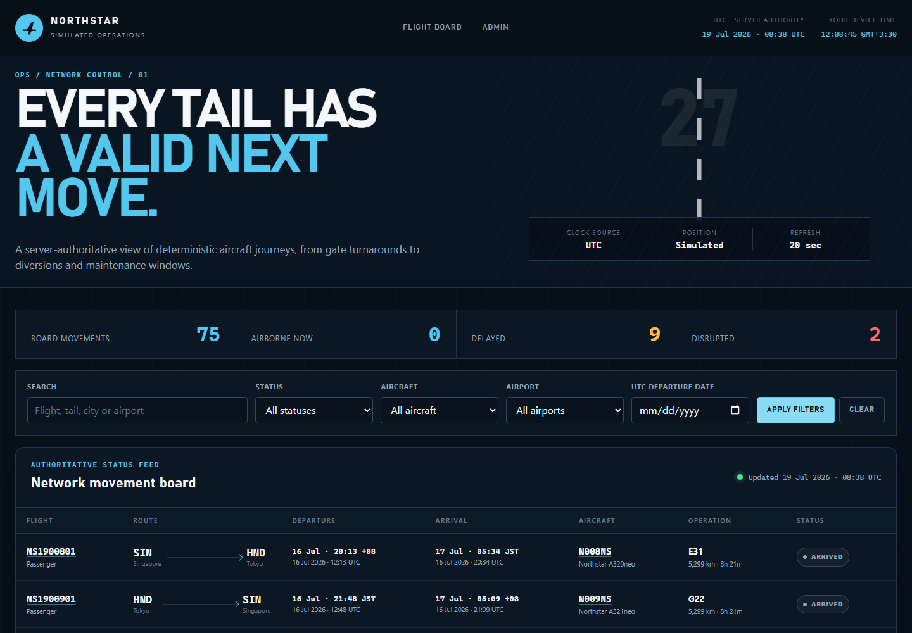
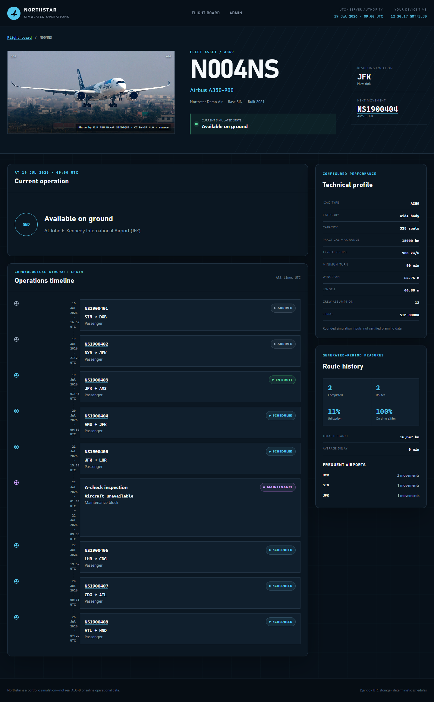

# Northstar Flight Operations

A focused Django portfolio project that turns a simple random flight board into a
deterministic aircraft-scheduling simulation. Every aircraft follows one chronological
journey with range, airport continuity, turnaround, disruption, and maintenance rules
validated before data is committed.

> **This is a simulated flight operations showcase and does not use real ADS-B or airline operational data.**

## What the showcase demonstrates

- Aircraft-specific itineraries instead of independent random rows
- Haversine route distance and transparent distance-based block-time estimates
- Practical aircraft range and minimum-turnaround enforcement
- Delay propagation, cancellations, diversions, ferry legs, and maintenance blocks
- One authoritative server-side flight lifecycle with exact boundary tests
- UTC storage plus explicitly labelled UTC and airport-local display times
- A filterable, responsive flight board refreshed from JSON every 20 seconds
- A persistent, controllable simulation clock shared by every operational view
- A responsive live network map rendered with MapLibre from a bounded Django feed
- Great-circle routes, bearings, and schedule-derived interpolation powered by Turf
- Aircraft pages with licensed model-specific photography, current state, technical data, and timelines
- Flight detail pages comparing scheduled, estimated, and actual timing
- Structured validation errors, atomic generation, and rollback on violations
- Bounded/select-related queries, accessible focus states, no-JavaScript fallback, and mobile cards

## Scheduling algorithm

For each aircraft, the generator starts at its base airport and keeps a simulated
current airport and effective-ready timestamp. Each next destination must be
different and within 90% of configured maximum range. Block time combines taxi-out,
climb, cruise at an efficiency-adjusted typical speed, descent, taxi-in, and a small
variability allowance.

After each operating leg, the aircraft moves to the planned arrival airport or the
diversion airport. A cancelled leg does not move it. The next effective departure is
pushed beyond the previous effective arrival plus type-specific turnaround. Generated
maintenance windows push readiness farther forward. The entire stored plus proposed
schedule is validated inside one transaction before batched flight insertion.

~~~mermaid
flowchart LR
    CLI[generate_data command] --> GEN[Deterministic generator]
    GEN --> DIST[Distance + duration]
    GEN --> VAR[Operational variations]
    DIST --> VAL[Schedule validator]
    VAR --> VAL
    VAL -->|0 violations| DB[(SQLite)]
    VAL -->|violations| ROLLBACK[Atomic rollback]
    DB --> VIEWS[Thin Django views]
    VIEWS --> STATUS[Status + presentation services]
    STATUS --> HTML[Server-rendered board/details]
    STATUS --> JSON[Read-only polling JSON]
~~~

## Enforced constraints

The database, model layer, and cross-flight validator collectively enforce:

1. Different departure and arrival airports
2. Ordered scheduled, estimated, and actual timestamps
3. Non-negative distance and delay; positive duration and aircraft performance values
4. Unique aircraft registration and flight number
5. No overlapping movements for one aircraft
6. Minimum type-specific turnaround between operating flights
7. Departure from the aircraft's real resulting airport
8. Explicit ferry labelling for repositioning movements
9. Route distance within conservative practical range
10. Plausible duration relative to route distance and aircraft type
11. No movement timestamps or diversion on cancelled flights
12. A distinct, valid diversion airport that becomes the resulting location
13. No operation overlapping a maintenance block
14. Coherent actual departure and arrival timestamps
15. Full-schedule validation before transaction commit

The validator returns structured ScheduleViolation records with a code, message,
aircraft registration, and flight number.

## Status lifecycle

tracker.services.status.get_flight_status(flight, at_time) is the only lifecycle
authority. It uses actual timestamps first, then estimates, then schedule:

~~~text
scheduled → check-in → boarding → gate closed → departed → en route → arrived
                              ↘ delayed
                              ↘ cancelled
                              ↘ diverted
~~~

An actual arrival wins over clock windows. Cancellation is terminal. A recorded
diversion is explicit and its airport drives subsequent continuity. Exact departure,
ten-minute post-departure, and arrival boundaries are tested.

Estimated journey progress is elapsed effective block time divided by total effective
block time, clamped to 0–100%. It is labelled as an estimate and is not presented as a
live position.

## Timezone strategy

- Django uses USE_TZ=True and stores aware UTC timestamps.
- Status receives one authoritative aware instant from the server.
- The board labels UTC as the server authority.
- Departure and arrival times are converted with each airport's IANA timezone.
- The browser clock is labelled **Your device time** and never affects status.
- JSON responses include a server-generated UTC timestamp and Cache-Control: no-store.

## Quick start

Python 3.10–3.14 is supported by the pinned Django 5.2 LTS line.

~~~bash
python -m venv .venv
~~~

Activate the environment:

~~~bash
# macOS / Linux
source .venv/bin/activate

# Windows PowerShell
..venvScriptsActivate.ps1
~~~

Then install and run:

~~~bash
python -m pip install -r requirements.txt
python manage.py migrate
python manage.py generate_data --seed 20260719 --clear
python manage.py simulation_clock --status
python manage.py runserver
~~~

Open http://127.0.0.1:8000/ for the flight board or
http://127.0.0.1:8000/network-map/ for the live simulation map. Built JavaScript
and CSS bundles are committed, so normal Python demo use does not require Node.js.

Configuration is optional for local development. Copy .env.example values into your
environment when you need to change the secret, debug mode, or allowed hosts.

## Data generation

The recommended showcase command is:

~~~bash
python manage.py generate_data \
  --seed 20260719 \
  --aircraft-count 12 \
  --days-back 3 \
  --days-forward 7 \
  --min-flights-per-aircraft 4 \
  --max-flights-per-aircraft 10 \
  --clear
~~~

An eight-digit YYYYMMDD seed also determines the UTC-noon schedule anchor. Other
integer seeds map to a stable reference date. Use --anchor-date YYYY-MM-DD to keep a
chosen random seed while placing the schedule on a specific date.

| Option | Default | Purpose |
| --- | ---: | --- |
| --seed | 20260719 | Random stream and deterministic default anchor |
| --anchor-date | derived | Explicit UTC schedule date |
| --clear | off | Delete simulation data before generating |
| --aircraft-count | 12 | New aircraft to schedule |
| --days-back / --days-forward | 3 / 7 | Generated window around the anchor |
| --min-flights-per-aircraft | 4 | Minimum itinerary length |
| --max-flights-per-aircraft | 10 | Maximum itinerary length |
| --delay-rate | 0.18 | Delay probability |
| --cancellation-rate | 0.04 | Cancellation probability |
| --diversion-rate | 0.03 | Diversion probability |
| --ferry-rate | 0.08 | Explicit ferry probability |
| --maintenance-rate | 0.06 | Maintenance-block probability |
| --validate-only | off | Validate stored data without mutation |

Data is never deleted unless --clear is supplied. Generation and validation share
one atomic transaction.

## Simulation clock

The singleton `SimulationClock` stores a deterministic schedule anchor, its matching
wall-clock start, a speed multiplier, and pause state. Operational pages and JSON
feeds read that shared clock instead of independently reading wall time. Generating
with `--clear` resets the clock inside the same transaction; append generation leaves
it intact. The clock can be inspected, paused, resumed, reset, or accelerated:

~~~bash
python manage.py simulation_clock --status
python manage.py simulation_clock --pause
python manage.py simulation_clock --resume
python manage.py simulation_clock --speed 5
python manage.py simulation_clock --reset
~~~

The map polls authoritative state every 15 seconds. Between responses, Turf
interpolates a visual position along a great-circle route from effective departure,
arrival, and simulation timestamps. MapLibre keeps persistent GeoJSON sources and
layers rather than recreating the map. Pausing visual motion in the browser does not
pause the server clock.

Aircraft positions are interpolated from the deterministic schedule and authoritative
simulation clock. They are not GPS, ADS-B, radar, or airline operational positions.

## Routes

| Route | Purpose |
| --- | --- |
| / | Filterable operations board |
| /board/data/ | Read-only polling JSON with server-rendered rows |
| /network-map/ | Interactive simulated live network map |
| /network-map/data/ | Bounded, no-store JSON snapshot for the map |
| /aircraft/&lt;registration&gt;/ | Aircraft state, metrics, and timeline |
| /flights/&lt;flight-number&gt;/ | Flight operation detail |
| /admin/ | Validated operational data management |

## Tests and quality checks

~~~bash
python -m pip install -r requirements-dev.txt
python manage.py check
python manage.py makemigrations --check
python manage.py test
coverage run manage.py test
coverage report
ruff check .
ruff format --check .
npm ci
npm run build
npm test
npm run check:generated
~~~

Coverage includes models, lifecycle boundaries, timezone equivalence, distance and
duration, unsafe-schedule detection, deterministic generation across multiple seeds,
command rollback, simulation-clock transitions, filters, JSON polling, bounded map
queries, detail pages, great-circle geometry, client reconciliation, reduced-motion
behavior, and persistent MapLibre source updates.

Node.js is needed only when maintaining or verifying map assets. `npm run build`
bundles the pinned MapLibre and modular Turf dependencies with esbuild; the generated
files in `tracker/static/tracker/dist/` must be committed with source changes.

## Project structure

~~~text
airline/                         Django project settings and root URLs
tracker/
├── management/commands/         Thin generation CLI
├── migrations/                  Data-preserving aviation-domain migration
├── services/
│   ├── analytics.py             Aircraft statistics and merged timeline
│   ├── distance.py              Haversine and block-time assumptions
│   ├── fixtures.py              Small transparent reference dataset
│   ├── generator.py             Deterministic itinerary construction
│   ├── presentation.py          Shared HTML/JSON row representation
│   ├── status.py                Single lifecycle authority
│   └── validation.py            Structured cross-flight invariants
├── static/tracker/              Local CSS, JavaScript, aircraft photos, and fallback SVG
├── templates/tracker/           Board and detail pages
└── tests/                       Domain, engine, command, and view coverage
docs/                            Baseline, assumptions, attribution, screenshots
~~~

Map-specific additions include `tracker/services/clock.py`,
`tracker/services/map_data.py`, the `tracker/assets/network-map/` source and Vitest
suite, committed output in `tracker/static/tracker/dist/`, and
`docs/LIVE_MAP_ARCHITECTURE.md`.

## Simulation assumptions and limitations

This is an understandable operations simulation, not certified dispatch software.
Cruise speeds, ranges, capacities, dimensions, and turnaround values are rounded
illustrative inputs. Great-circle distance omits airway routing, winds, weather,
airspace restrictions, payload-range trade-offs, slot controls, and crew legality.
Progress is time interpolation, not ADS-B.

See [simulation assumptions](docs/SIMULATION_ASSUMPTIONS.md) and
[live map architecture](docs/LIVE_MAP_ARCHITECTURE.md) for technical detail, and
[image attribution](docs/IMAGE_ATTRIBUTIONS.md) for media sources.

## Roadmap

- Optional airport detail page with simulated network statistics
- Export a validated itinerary as CSV
- More explicit landed-to-gate transition if the domain adds an on-block timestamp

## License

No repository licence has been selected. All rights remain with the repository owner
until a licence is intentionally added.
